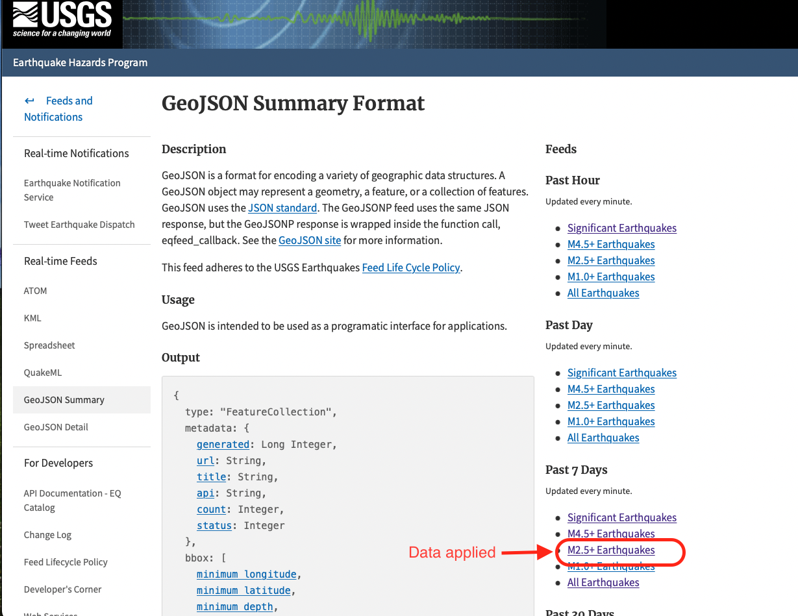
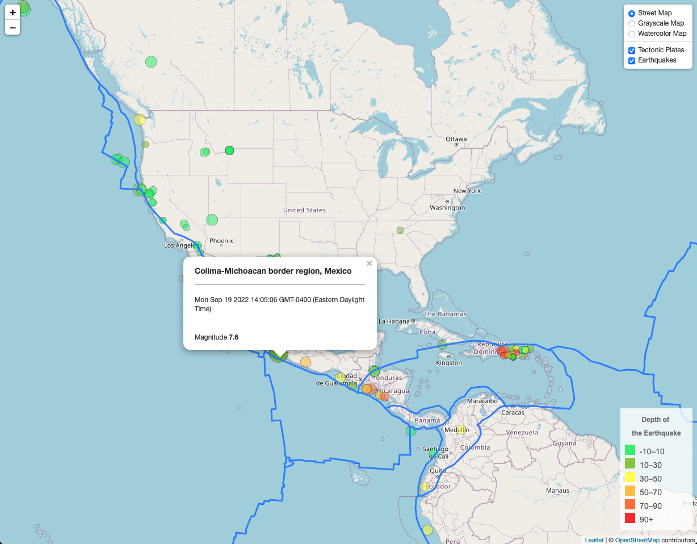

# Visualizing Data with Leaflet

## Background

The United States Geological Survey, or USGS for short, is responsible for providing scientific data about natural hazards, the health of our ecosystems and environment, and the impacts of climate and land-use change. Their scientists develop new methods and tools to supply timely, relevant, and useful information about the Earth and its processes.

The USGS is interested in building a new set of tools that will allow them to visualize their earthquake data. They collect a massive amount of data from all over the world each day, but they lack a meaningful way of displaying it. Their hope is that being able to visualize their data will allow them to better educate the public and other government organizations (and hopefully secure more funding) on issues facing our planet.

## Visualizing

In order to show the data on the world map in didfferent layers, this project is broken into two parts: 

* Part 1: Create the Earthquake Visualization base on USGS M2.5+ Earthquakes data of past 7 days

* Part 2: Gather and Plot tectonic plates dataset along with the earthquakes data in Part 1

### Part 1: Create the Earthquake Visualization

To visualize the earthquake dataset. I have Completed the following steps:

1. Get the dataset from USGS: 

   * The USGS provides earthquake data in a number of different formats, updated every five minutes. Visit the [USGS GeoJSON Feed](http://earthquake.usgs.gov/earthquakes/feed/v1.0/geojson.php) page and choose M2.5+ Earthquakes data of past 7 days to visualize:

   

    * click the dataset (M2.5+ Earthquakes from the Past 7 Days)to get a JSON representation of that data. Use the URL of this JSON to pull in the data for the visualization.

2. Import and visualize the data by doing the following: 

   * Using Leaflet, create a map that plots all the earthquakes from the dataset based on their longitude and latitude.

       *  The data markers reflect the magnitude of the earthquake by their size and the depth of the earthquake by color. Earthquakes with higher magnitudes appear larger, and earthquakes with greater depth appear darker in color.

   * Include popups that provide additional information about the earthquake when its associated marker is clicked.

   * A legend that provides context for the map data.

- - -

### Part 2: Gather and Plot tectonic plates dataset

Part 2 plots a second dataset on the map to illustrate the relationship between tectonic plates and seismic activity. So, I pulled in this dataset and visualize it alongside the original data (in part 1). Data on tectonic plates can be found at <https://github.com/fraxen/tectonicplates>.

The following image shows the tectonic plates along with the earthquak markers:

* Plot the tectonic plates dataset on the map in addition to the earthquakes.

* There are three base maps to choose from- Street, Grayscale, Watercolor.

* Separated overlays- Tectonic Plates and Earthquakes, that can be turned on and off independently.

* Layer controls to the map is added as well.

